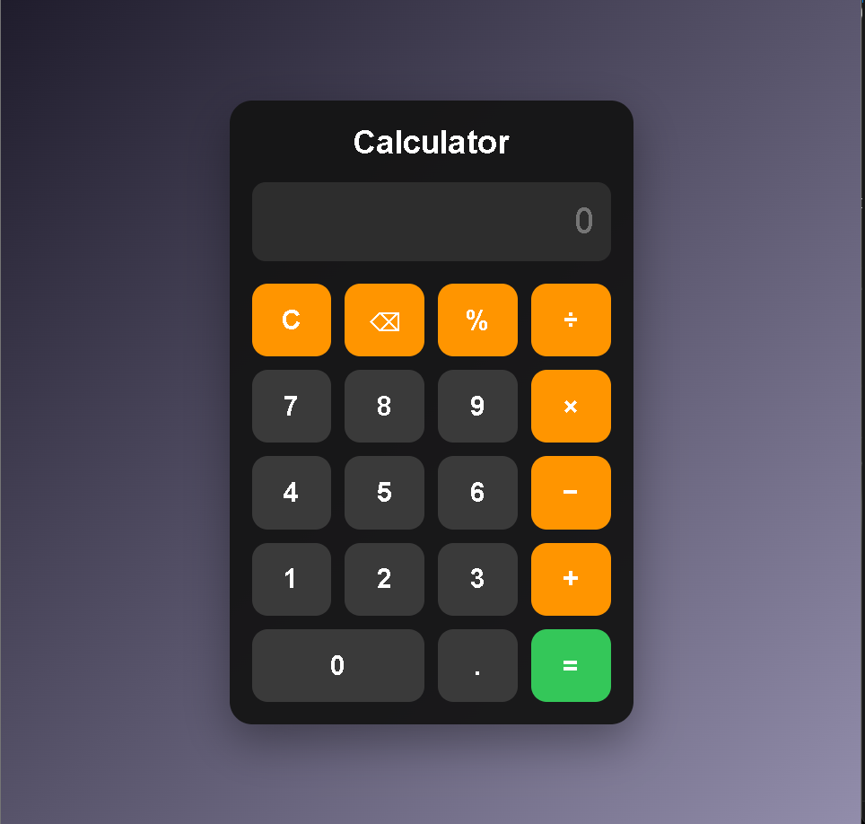

# 🧮 Calculator Web App

A modern and responsive calculator web application built using **HTML**, **CSS**, and **JavaScript**.  
This project demonstrates clean UI design, DOM manipulation, and interactive functionality with keyboard support.

---

## 🚀 Features

- ➕ Basic arithmetic operations (Addition, Subtraction, Multiplication, Division)
- ⌫ Backspace (delete last digit)
- 🧹 Clear display (reset)
- ⌨️ Keyboard input support
- 🧠 Input validation to prevent invalid expressions
- 🎨 Modern UI with smooth hover and click effects
- 📱 Fully responsive design

---

## 🛠️ Technologies Used

- **HTML5** – Structure of the application  
- **CSS3** – Styling and layout  
- **JavaScript (ES6)** – Logic and functionality  

---

## 📂 Project Structure
calculator/
│
├── index.html
├── style.css
├── index.js
└── README.md

---

## ▶️ How to Run

1. Clone the repository:https://github.com/mohdhi5253/Calculator.git

3. Open `index.html` in your browser

---

## 🌐 Live Demo

http://127.0.0.1:5501/index.html

---

## 📸 Preview

---

## 💡 Key Learning Outcomes

- DOM manipulation using JavaScript  
- Handling user input and validation  
- Event handling (click and keyboard events)  
- Responsive UI design using CSS Grid  
- Structuring a clean frontend project  

---

## 🚀 Future Improvements

- 🌙 Dark and Light mode toggle  
- 📊 Calculation history  
- 🧾 Scientific calculator features  
- 📱 Mobile app version  

---

## 🤝 Contributing

Contributions are welcome!  
Feel free to fork the repository and submit a pull request.

---

## 📄 License

This project is open-source and available under the **MIT License**.

---

## 👨‍💻 Author

**Mohammad Dhilawala**

---

## ⭐ Support

If you like this project, please give it a ⭐ on GitHub!